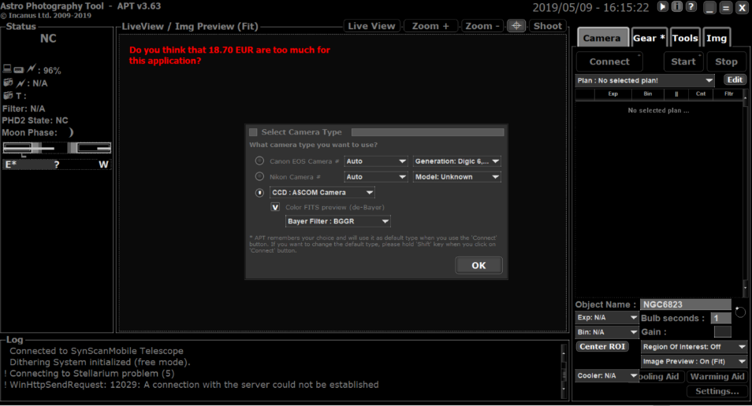
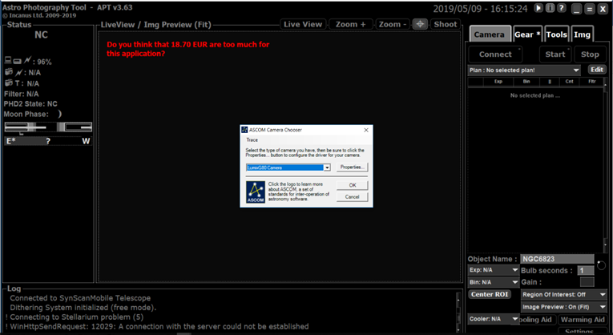
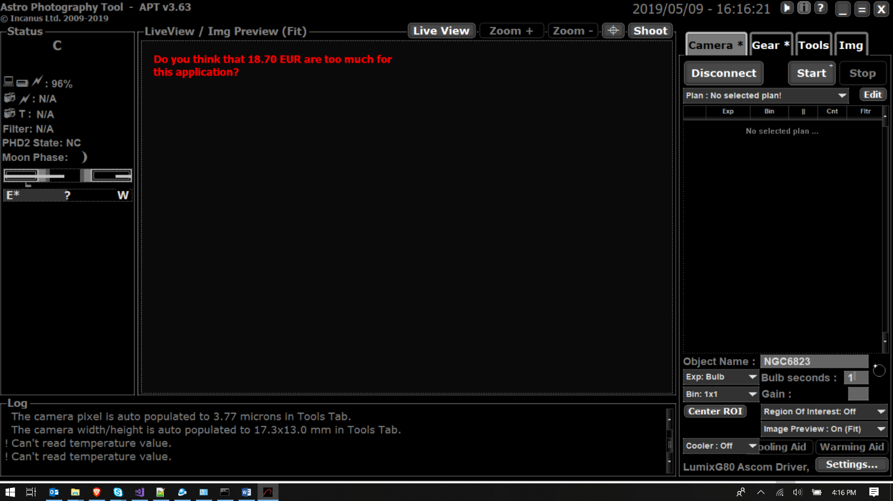

# ASCOM Camera driver for Panasonic Lumix Cameras

## Purpose

This driver provides an interface to the Lumix http over wifi remote control protocol in order to present lumix cameras as ASCOM cameras and be used by astro photo software like APT. The camera believes that it is connected to the Panasonic ImageApp

The driver was tested with the G80, GH4 and GH5s but should work with all Wifi Lumix.
16MP sensor was the prototype. Now it is possible to work with a range of sensor sizes such as:  
 * 10M (GH5s) 
 * 12MP(GH1) 
 * 16MP (GH4, G80, etc.)
 * 20MP (GH5, G9, etc.)

Notes: 
1. Since ASCOM does not expose any "liveView" or video mode this is not implemented here. 
Mostly this driver sets the ISO (i.e. Gain), ShutterSpeed, Capture (Start and Abort) and GetImageArray methods along with other needed methods for ASCOM.
3. All settings are stored in the ASCOM Proflie Explorer
4. Trace log is stored in default ASCOM location 
2. Presumably could also work with the full frame S series from Panasonic since it shares the same http protocol. The different format of the sensor should be handled but i have no way of testing it. (this is a call to get loaned an S1 to test!)

 
## Usage

<a href="https://www.youtube.com/watch?v=pKYlJDv_kuE" target="_blank">Video tutorial</a> is available  

First [install](#install) the driver. Of course you need to have <a href="https://ascom-standards.org/" target="_blank">ASCOM platform</a> installed on your target windows PC.  
To connect your PC to the camera:
1.	First on the camera (similar to what is needed with the Panasonic ImageApp)
	1.	Prerequisites 
		1. set it to "M"
		2.	make sure there is an SD card too. (this exception is not handled yet)
		3.	best if camera is set to manual focus too. (indeed if the camera tries to capture and cannot find a focus it will not capture. that exception is not handlded yet)
	2.	Connect to a wifi network where you will also connect your PC
	3.	Camera then waits for an app to connect
	4.  Proceed to steps on the PC. If you are too slow to do these steps on the PC the camera will timeout and leave the waiting to connect status.
	
	
2.	On the PC
	1. launch the Imaging software (e.g. APT)
	
	2. choose the LumixG80 Ascom from the chooser window and click properties
	
	3. the driver will look for the Lumix camera on the local wifi network and connect to it (the camera should say "under remote control")
	
		
	4.	IP address is populated by the driver after its discovery.
	5.	Check that the correct resolution for your camera is discovered  
	4.	set the ISO, Speed and TransferFormat (JPG, Thumb or Raw): read below for details
	6.	Temp folder to store the files from the camera. 
	8.	Path to the DCraw.exe file that is required to deal with the RAW file from the camera. This File is distributed with the setup and should be in C:\Program Files (x86)\Common Files\ASCOM\Camera
	9.	hit ok.
	10.	The Astro Software then gets data from the driver like the pixel pitch but does not get the temperature… in your Astro Software you can then set the Bulb seconds of the capture the gain etc. 
	
	11. You can now shoot!
	
	12. in APT you can then also (and more importantly)use the image received by the driver to perform platesolving.
	13. AGAIN NO LIVEVIEW supported. this is beyond what ASCOM does. For Live view you can look at alternatives discussed <a href= "https://www.personal-view.com/talks/discussion/6703/control-your-gh3-from-a-web-browser-now-with-video-/p1" target="_blank"> here </a>the beauty is that they can work in parallel to the ASCOM driver since the Lumix camera is just a "Media Server".

The driver allows to set the speed, iso and format of the camera transfers the image (Raw or JPG) on the PC and exposes the image array in RGB to the calling program. This will create a 16bit image regardless of what the transfer format waas. Note that the driver will force the camera to store RAW and Fine JPG.

It relies on DCRaw to handle the Raw format, or the native VB.NET imaging for JPG
Images are then translated into Tiff and then passed to the image array.

RAW would be preferred but the file is substantially larger and therefore longer to transfer. Therefore the download is often interrupted. the driver tries to recover/continue the download  but it does not always work smoothly. this leaves with an incomplete RAW file that is still passed on but not ideal.

Given the longer transfer time it substantially cuts into the active shooting since all this process is sequential
So, if you have a 1mn exposure and it takes 40s to get it onto your driver that is 40s you are not shooting...

Hence the jpg transfer option. file is smaller and transfer faster and should still be valuable for the Astro SW.
in any case the camera keeps the RAW or the RAW+jpg on the SD card and the Astro SW should have a fits file from the driver. The transferred files (jpg or raw) and intermediary tiff files are deleted as soon as possible (i.e. once the imagearray has been passed to the astro Software) in order to save disk space. Code is quite nasty and could use some factoring into further utility classes/methods etc.

I added a "thumb" transfer mode which takes a large thumbnail of the image (1440x1080) in order to further reduce the transfer size. I am not sure if this helps much and if it will screw up the platesolving since now resolution is different from the actual sensor size. In this case though the pixelpitch is changed in the driver so to help in that process.

Lastly there is still a pending issue with 14 bit RAWs from GH5s. this has to do with DCRaw that does not yet handle this format. For that reason, it is best for GH5s to use JPG format (or thumb)
If DCRaw gets updated, just replace the DCRaw.exe on your driver with the newer version and point to it usinf the "Path to DCRaw.exe" option in settings

# <a name = "install"> Installation
for windows 32 and 64 bit. download and run ASCOM.LumixG80.Camera Setup.exe.

Implements:	ASCOM Camera interface version: 2.0
 Author:		robert hasson robert_hasson@yahoo.com
 this is freeware. no support, no liability whatsoever, use at your own risk, etc...

# Credits to 
 ASCOM library : https://ascom-standards.org/

 DCRaw: https://www.cybercom.net/~dcoffin/dcraw/
 
 NDCRaw : https://github.com/AerisG222/NDCRaw
 
 MedallionScript: https://github.com/madelson/MedallionShell

the lumix Wifi interface protocol is heavily discussed here: https://www.personal-view.com/talks/discussion/6703/control-your-gh3-from-a-web-browser-now-with-video-/p1

# License
Copyright (c) 2019 < robert hasson robert_hasson@yahoo.com>
This work is licensed under the Creative Commons Attribution-No Derivative Works 3.0 License. To view a copy of this license, visit http://creativecommons.org/licenses/by-nd/3.0/ or send a letter to Creative Commons, 171 Second Street, Suite 300, San Francisco, California, 94105, USA

Permission is hereby granted, free of charge, to any person obtaining a copy of this software and associated documentation files (the "Software"), to deal in the Software without restriction, including without limitation the rights to use, copy, modify, merge, publish, distribute, sublicense, and/or sell copies of the Software, and to permit persons to whom the Software is furnished to do so, subject to the following conditions:
The above copyright notice and this permission notice shall be included in all copies or substantial portions of the Software.
THE SOFTWARE IS PROVIDED "AS IS", WITHOUT WARRANTY OF ANY KIND, EXPRESS OR IMPLIED, INCLUDING BUT NOT LIMITED TO THE WARRANTIES OF MERCHANTABILITY, FITNESS FOR A PARTICULAR PURPOSE AND NONINFRINGEMENT. IN NO EVENT SHALL THE AUTHORS OR COPYRIGHT HOLDERS BE LIABLE FOR ANY CLAIM, DAMAGES OR OTHER LIABILITY, WHETHER IN AN ACTION OF CONTRACT, TORT OR OTHERWISE, ARISING FROM, OUT OF OR IN CONNECTION WITH THE SOFTWARE OR THE USE OR OTHER DEALINGS IN THE SOFTWARE.